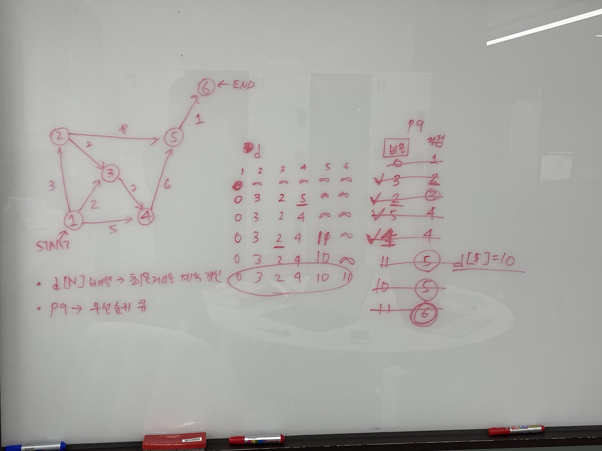

# [1753](https://www.acmicpc.net/problem/1753)
Created on: 2023-11-28



서지가 대신 고쳐준 코드..
다시 풀어보자

```cpp
#include <iostream>
#include <algorithm>
#include <vector>
#include <queue>
using namespace std;

#define ll long long
#define f(i, n) for (int i = 0; i < n; i++)
#define COST first
#define DST second

const int MAX_POINT = 20000;
const int INF = 0x7fffffff;

int V, E, start; 															// 정점의 개수, 간선의 개수, 시작 정점
int bestPath[MAX_POINT + 1];									// index로 가는 최단 경로의 비용
vector<pair<int, int> > path[MAX_POINT + 1];	// index: 시작 정점, first: 비용, second: 도착 정점

priority_queue<pair<int, int>, vector<pair<int ,int> >, greater<pair<int, int> > > pq; // 다음에 방문할 정점

int	main(void)
{
	ios::sync_with_stdio(false), cin.tie(nullptr);

	cin >> V >> E >> start;

	// 간선 받기
	for (int i = 0; i < E; i++)
	{
		int src, dst, cost;
		cin >> src >> dst >> cost;
		path[src].push_back(make_pair(cost, dst));
		// 만약 출발지라면 큐에 넣는다.
		// if (src == start)
		// {
		// 	pq.push(make_pair(cost, dst));
		// }
	}

	// 무한대로 초기화
	for (int i = 1; i <= V; i++)
	{
		bestPath[i] = INF;
	}

	// 시작 정점 0으로 초기화
	bestPath[start] = 0;
	pq.push({0, start});

	while (!pq.empty())
	{
		int cost = pq.top().COST;
		int cur = pq.top().DST;
		pq.pop();

		if (bestPath[cur] != cost)
			continue;
		// 앞으로 갈 경로가 bestPath 보다 비용이 더 작으면 bestPath 갱신
		// 목적지 노드에서 갈 수 있는 경로 pq에 삽입
		// for (vector<pair<int, int> >::iterator it = path[dst].begin(); it != path[dst].end(); it++)
		for(size_t i = 0; i < path[cur].size(); i++) // cur에서 갈 수 있는 목적지들
		{
			if (bestPath[path[cur][i].DST] < bestPath[cur] + path[cur][i].COST)
				continue;
			bestPath[path[cur][i].DST] = bestPath[cur] + path[cur][i].COST;
			pq.push({bestPath[path[cur][i].DST], path[cur][i].DST});
			// if (cost + bestPath[cur] < bestPath[it])
			// {
			// 	bestPath[dst] = cost + bestPath[start];
			// }
		}
		// start = dst;
	}

	for (int i = 1; i <= V; i++)
	{
		if (bestPath[i] == INF)
			cout << "INF\n";
		else
			cout << bestPath[i] << '\n';
	}

	return 0;
}
```

## References


